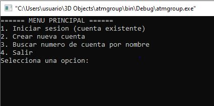

# Como instalar el ATM (Ulises)
Para instalarlo es muy sencillo primeramente debemos de tener instalado **codeblocks** ya teniendo como clave eso solo tendras que descargar la carpeta completa llamada **_atmgroupff_**
que es la siguiente : 


Teniendo esta carpeta solamente hay que abrir **codeblocks** y seleccionar la opcion centrada llamada **open an existing project**:


despues de seleccionar esa opcion solo abriremos la carpeta descargada y seleccionaremos el siguiente archivo para posteriormente abrirlo y que se corra por completo el programa junto con los headers: 


Ya despues de seleccionarlo: 


Y lsto tendrias instalado el ATM.
# Guia de usuario (Edwin)
El porgrama es muy sencillo de usar al iniciar te muestra las siguientes opciones:
1. Iniciar sesion (cuenta existente)
2. Crear nueva cuenta
3. Buscar numero de cuenta por nombre
4. Salir
   

 
La numero 1 "Iniciar sesion con cuenta existente" te abrira una ventana en la cual te pedira tus dos datos escenciales _**numero de cuenta y pin**_ te dara 3 intentos para ingresar con la cuenta que quieres acceder si fallas en las licencias te sacara de la app.
Si los datos son correctos abrira el siguiente menu:


Al presionar 1 solamente te dejara ver tu saldo actual de la siguiente manera:


Como lo menciona, si deseas seguir usandolo hay que presionar 1 y te sacara de nuevo al menu, si presionamos la opcion dos **depositar dinero** se abrira el siguiente menu donde solo tenemos que ingresar la cantidad que deseamos ingresar:


Si salimos de nuevo con la opcion 1 el siguiente punto 3 **retirar dinero** nos habilitara la funcion retirara saldo solo con ingresar el monto deseado de la siguiente manera:  


Por ultimo el punto cuatro pero no menos importante **historico** aqui te mostrara todos tus ultimos movimientos agregandoles un signo **+** a los ingresos y un signo **-** a los retiros de la siguiente manera:  


En el menu principal muestra otrsa dos opciones para iniciar sesion, una es crear cuenta nueva esa solo te pedira que hags un registro de tu nombre y apellidos y agregues un pin al hacerlo te generara tu numero de cuenta autamaticamente de esta manera: 


Por ultmo **buscar cliente** esa opcion te permitira buscar al cliente por su nombre para que te arroje el numero de cuenta.


# Estructura y Prototipado de Funciones (Juan)

###  Estructura principal

```c
#define MAX_CLIENTES 100

typedef struct {
    int numClientes;
    char nombre[50];
    float saldo;
    int pin;
    float historico;
} Cliente;

 **Funciones**//

// Verificaciones y lógica de interacción
int verificacion(float X);
int OtraOperacion(void);
int PIN(int pinCorrecto);
void LimpiarPantalla(void);

// Operaciones bancarias
int ConsultarSaldo(float saldo);
int Depositardinero(float *saldo);
int RetirarDinero(float *saldo);

// Gestión de cuentas
int Buscar(Cliente clientes[], int numClientes, const char *nombreBuscado);
int NuevaCuenta(Cliente clientes[], int *numClientes);

// Persistencia y almacenamiento
int CargarClientes(Cliente clientes[], int *numClientes, const char *filename);
int GuardarClientes(Cliente clientes[], int numClientes, const char *filename);
void RegistrarHistorico(int numCliente, float monto, char tipo, const char *filename);
void MostrarHistorico(const char *filename, int numCliente);
